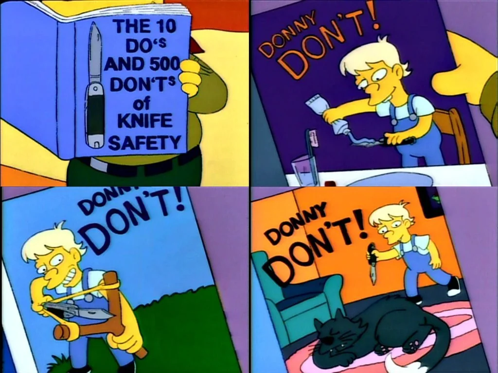
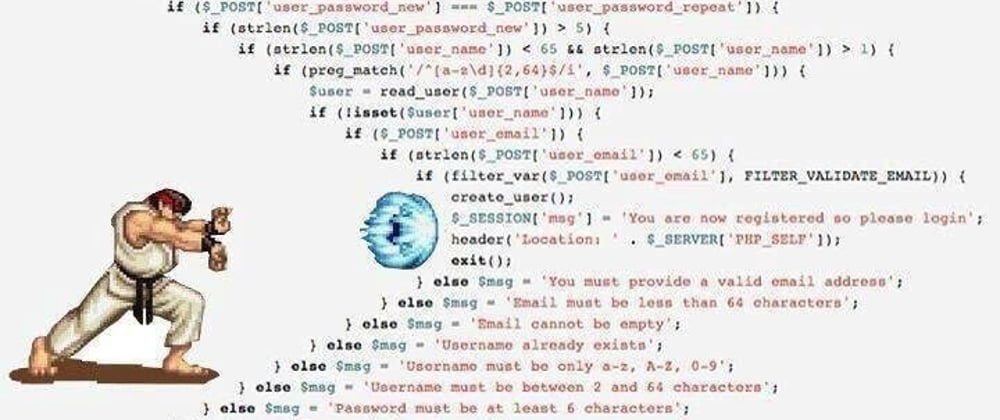

# Condicionales

## Estructuras

Estructuras que permiten tomar decisiones en el flujo de ejecución de un programa.

1. If, Else, Else If

Los condicionales "if-else if" son una forma de tomar decisiones en programación. Funcionan de la siguiente manera:

- Se inicia con un "if" que evalúa una condición. Si la condición es verdadera, se ejecuta un bloque de código asociado a ese "if".
- Si la condición del primer "if" es falsa, se pasa al siguiente "else if" (si lo hay). Se evalúa la condición del "else if", y si es verdadera, se ejecuta el bloque de código asociado a ese "else if".
- Este proceso se repite para cada "else if" en secuencia hasta que se encuentra una condición verdadera o hasta que no hay más "else if". Si se encuentra una condición verdadera, se ejecuta el bloque de código correspondiente y se sale de la estructura condicional.
- Si ninguna de las condiciones "if" o "else if" es verdadera, se ejecuta el bloque de código del "else" (si está presente), que es el último recurso.

Ejemplo de if:
```go
if edad < 18 {
    fmt.Println("No puedes pasar")
}
```

Ejemplo de if-else
```go
edad := 65

if edad < 18 {
    fmt.Println("No puedes pasar")
} else {
    fmt.Println("Puedes pasar")
}
```

Ejemplo de if-else if
```go
edad := 18

if edad < 18 {
    fmt.Println("No puedes pasar")
} else if edad > 50 {
    fmt.Println("No puedes pasar")
} else  {
    fmt.Println("Tienes que ser mayor de 18 años y menor de 50 años para poder pasar"
}
```

2. Switch

La estructura switch es una forma de control de flujo en programación que permite simplificar múltiples comparaciones de una variable contra diferentes valores. Funciona de la siguiente manera:

**Inicio de switch:** La estructura comienza con la palabra clave switch, seguida de la variable o expresión que quieres comparar.

**Casos (case):** Dentro del bloque de switch, defines diferentes casos usando la palabra clave case, seguida de un valor específico que quieres comparar con la variable o expresión del switch. Si la variable o expresión coincide con el valor del case, se ejecuta el bloque de código asociado a ese case.

**Ejecución de un Caso:** Cuando se encuentra una coincidencia entre la variable y un case, se ejecuta el código asociado a ese case y luego se sale de la estructura switch. Esto significa que solo se ejecuta el código de un case coincidente.

**Break:** Aunque en algunos lenguajes es necesario usar la palabra clave break al final de cada bloque case para evitar que el control fluya hacia el siguiente case, en algunos lenguajes modernos como Go, el break es implícito y no es necesario escribirlo.

**default:** Puedes incluir un default al final del switch, que se ejecutará si ninguno de los case coincide. Es similar a un else en una estructura if-else.

```go
var monthNumber int = 3
var station string

switch {
    case monthNumber >= 1 && monthNumber < 3:
        station = "Winter"
    case monthNumber >= 3 && monthNumber < 6:
        station = "Spring"
    case monthNumber >= 6 && monthNumber < 9:
        station = "Summer"
    case monthNumber >= 9 && monthNumber < 12:
        station = "Autumn"
    default:
        station = "Ninguna Estación del Año!"
}
fmt.Println(station)
```

**Fallthrough:** Se usa cuando se desea que el flujo siga
```go
switch num := 2; num {
case 1:
    fmt.Println("Uno")
case 2:
    fmt.Println("Dos")
    fallthrough
case 3:
    fmt.Println("Tres")
}
```

**Finally:** No existe en go, pero podemos usar defer en su lugar (se hablara en proximos capitulos de esto)

3. Goto

Una opcion para saltar un bloque de codigo, y no se detiene el flujo normal del programa. Se usa cuando se desea que el flujo siga

```go
num  := 10

if num > 15 {
    goto fin
}
fmt.Println("Saliendo del if")

fin: 
    fmt.Println("Fin del programa")
```

Aunque se puede usar, no se recomienda, ya que puede generar dificultad de lectura y mantenimiento.

## Buenas practicas



1. Usar Early Returns (retornos tempranos)

    ¿Qué es?

    Se trata de devolver el control lo antes posible, evitando anidar estructuras if innecesarias. Esto mejora la legibilidad y reduce la complejidad del código.

    ¿Cuándo usarlo?

    Cuando una condición es clara y el flujo de ejecución puede terminar pronto, lo ideal es realizar un "return" temprano para evitar la ejecución innecesaria del resto del código.

    Mal:

    ```go
    func checkAge(age int) {
        if age < 18 {
            fmt.Println("No puedes pasar")
        } else {
            fmt.Println("Puedes pasar")
        }
    }
    ```

    Mejor:

    ```go
    func checkAge(age int) {
        if age < 18 {
            fmt.Println("No puedes pasar")
            return
        }
        fmt.Println("Puedes pasar")
    }
    ```

2. Evitar anidaciones profundas

    ¿Qué es?

    Las anidaciones profundas (es decir, muchos if dentro de otros if) pueden hacer que el código sea difícil de leer y mantener. Es importante mantener las estructuras condicionales planas cuando sea posible.

    ¿Cuándo usarlo?

    Si tienes muchas condiciones anidadas, es probable que puedas refactorizar el código para hacerlo más plano y más fácil de entender.

    Mal:
    

    Mal:

    ```go
    func checkAge(age int) {
        if age >= 18 {
            if age <= 30 {
                fmt.Println("Eres joven")
            } else {
                fmt.Println("Eres adulto")
            }
        } else {
            fmt.Println("Eres menor de edad")
        }
    }
    ```

    Mejor:
    
    ```go
    func checkAge(age int) {
        if age < 18 {
            fmt.Println("Eres menor de edad")
            return
        }
        if age <= 30 {
            fmt.Println("Eres joven")
            return
        }
        fmt.Println("Eres adulto")
    }
    ```

3. Usar else solo cuando es necesario
    ¿Qué es?

    No siempre es necesario usar un bloque else después de un if. Si el if ya cubre el caso en que la condición es verdadera, puedes optar por salir del flujo con un return o continuar con el resto del código sin necesidad de un else.

    ¿Cuándo usarlo?

    Cuando el flujo de control no requiere una bifurcación inmediata después de una condición.

    Mal:

    ```go
    func checkDiscount(amount float64) {
        if amount >= 100 {
            fmt.Println("Descuento aplicado")
        } else {
            fmt.Println("No se aplica descuento")
        }
    }
    ```

    Mejor:
    
    ```go
    func checkDiscount(amount float64) {
        if amount >= 100 {
            fmt.Println("Descuento aplicado")
            return
        }
        fmt.Println("No se aplica descuento")
    }   
    ```

4. Evitar complejidad innecesaria en los condicionales
    ¿Qué es?

    Cuando las condiciones dentro de un if son complejas o difíciles de entender, es una señal de que el código puede beneficiarse de una refactorización. Los condicionales deben ser lo más claros y directos posibles.

    ¿Cuándo usarlo?

    Siempre que las condiciones sean muy complejas, es recomendable dividirlas en funciones auxiliares con nombres descriptivos para hacer el código más fácil de entender.

    Mal:

    ```go
    func checkEligibility(age int, isMember bool, salary float64) {
        if age > 18 && isMember && salary > 3000.0 {
            fmt.Println("Eres elegible")
        }
    }
    ```

    Mejor:

    ```go
    func isEligible(age int, isMember bool, salary float64) bool {
        return age > 18 && isMember && salary > 3000.0
    }

    func checkEligibility(age int, isMember bool, salary float64) {
        if isEligible(age, isMember, salary) {
            fmt.Println("Eres elegible")
        }
    }
    ```

5. Evitar goto innecesarios

    ¿Qué es?

    Aunque Go permite el uso de goto, su uso generalmente se debe evitar, ya que puede hacer que el flujo de ejecución sea más difícil de seguir y comprender. El uso de goto se debe restringir a casos muy específicos donde otras estructuras de control no son adecuadas.

    ¿Cuándo usarlo?

    El uso de goto debe evitarse en la mayoría de los casos, y se recomienda emplear estructuras de control como if, switch y for para un flujo más claro y mantenible.

    Mal:

    ```go
    func checkStatus(status string) {
        if status == "error" {
            goto fin
        }
        fmt.Println("Todo está bien")
        return

    fin:
        fmt.Println("Ocurrió un error")
    }
    ```

    Mejor:

    ```go
    func checkStatus(status string) {
        if status == "error" {
            fmt.Println("Ocurrió un error")
            return
        }
        fmt.Println("Todo está bien")
    }
    ```

6. Usar switch cuando sea apropiado

    ¿Qué es?

    En muchos casos, un switch puede hacer que tu código sea más claro y fácil de leer, especialmente cuando tienes varias opciones que comparar contra una misma variable. Usar switch en lugar de una larga cadena de if-else mejora la legibilidad.

    ¿Cuándo usarlo?

    Cuando tienes múltiples condiciones a evaluar sobre una misma variable o expresión. switch es más claro y conciso en este tipo de casos.

    Mal:
    ```go
    func season(month int) string {
        if month == 12 || month == 1 || month == 2 {
            return "Invierno"
        } else if month == 3 || month == 4 || month == 5 {
            return "Primavera"
        } else if month == 6 || month == 7 || month == 8 {
            return "Verano"
        } else if month == 9 || month == 10 || month == 11 {
            return "Otoño"
        }
        return "Mes inválido"
    }
    ```

    Mejor:

    ```go
    func season(month int) string {
        switch {
        case month == 12 || month == 1 || month == 2:
            return "Invierno"
        case month == 3 || month == 4 || month == 5:
            return "Primavera"
        case month == 6 || month == 7 || month == 8:
            return "Verano"
        case month == 9 || month == 10 || month == 11:
            return "Otoño"
        default:
            return "Mes inválido"
        }
    }
    ```

7. Uso de map frente a switch

    En Go, tanto map como switch son estructuras útiles para controlar el flujo de ejecución, pero en algunos casos, el uso de map es preferido sobre switch debido a su flexibilidad y rendimiento. Vamos a explorar por qué y cuándo es mejor usar un map y cómo puede ser más eficiente y limpio que un switch.

    **Ventajas del uso de map sobre switch**
    
    - Flexibilidad: Los map permiten una asociación de claves y valores mucho más dinámica. Pueden ser modificados en tiempo de ejecución, mientras que un switch es estático.
    - Mejor rendimiento: Para una gran cantidad de casos posibles, un map generalmente ofrece una búsqueda más eficiente. Un map proporciona un acceso constante O(1) en promedio para obtener un valor, mientras que en un switch, se evalúan cada uno de los casos hasta que se encuentra una coincidencia.
    - Escalabilidad: Cuando la cantidad de casos posibles crece, un map se mantiene limpio y escalable, mientras que un switch puede volverse difícil de manejar con muchos casos.

    **Ejemplo: Medios de pago**

    Imagina que tenemos que gestionar diferentes tipos de medios de pago: tarjeta de crédito, tarjeta de débito, efectivo, transferencia, y MercadoPago. Usaremos un map para hacer la asociación de cada tipo de pago con su respectiva acción o lógica de procesamiento, lo que resulta en un código más limpio y mantenible.

    Usando switch:

    ```go
    package main

    import "fmt"

    func processPayment(paymentMethod string, amount float64) {
        switch paymentMethod {
        case "tarjeta de credito":
            fmt.Println("Procesando pago con tarjeta de crédito:", amount)
        case "tarjeta de debito":
            fmt.Println("Procesando pago con tarjeta de débito:", amount)
        case "efectivo":
            fmt.Println("Procesando pago en efectivo:", amount)
        case "transferencia":
            fmt.Println("Procesando pago por transferencia bancaria:", amount)
        case "mercadopago":
            fmt.Println("Procesando pago con MercadoPago:", amount)
        default:
            fmt.Println("Método de pago no reconocido")
        }
    }

    func main() {
        processPayment("mercadopago", 1500.50)
    }
    ```

    > En este ejemplo, si tienes muchos más casos de medios de pago, el bloque switch puede volverse largo y difícil de gestionar. Cada vez que agregues un nuevo medio de pago, necesitarás agregar una nueva cláusula case, lo cual puede resultar engorroso a medida que aumentan los casos.

    Usando map

    ```go
    package main

    import "fmt"

    func processCreditCard(amount float64) {
        fmt.Println("Procesando pago con tarjeta de crédito:", amount)
    }

    func processDebitCard(amount float64) {
        fmt.Println("Procesando pago con tarjeta de débito:", amount)
    }

    func processCash(amount float64) {
        fmt.Println("Procesando pago en efectivo:", amount)
    }

    func processTransfer(amount float64) {
        fmt.Println("Procesando pago por transferencia bancaria:", amount)
    }

    func processMercadoPago(amount float64) {
        fmt.Println("Procesando pago con MercadoPago:", amount)
    }

    func main() {
        // Map de métodos de pago y sus respectivas funciones
        paymentMethods := map[string]func(float64){
            "tarjeta de credito": processCreditCard,
            "tarjeta de debito":  processDebitCard,
            "efectivo":           processCash,
            "transferencia":      processTransfer,
            "mercadopago":        processMercadoPago,
        }

        // Ejemplo de pago
        paymentMethod := "mercadopago"
        amount := 1500.50

        // Procesamos el pago si el método es válido
        if processFunc, exists := paymentMethods[paymentMethod]; exists {
            processFunc(amount)
        } else {
            fmt.Println("Método de pago no reconocido")
        }
    }
    ```

    **¿Por qué este enfoque es mejor?**

    - Escalabilidad: Si necesitas agregar más métodos de pago, solo tienes que agregar una nueva entrada en el map, sin necesidad de modificar un switch ni agregar más cláusulas case. Esto hace que el código sea mucho más fácil de escalar.
    - Flexibilidad: Si en algún momento decides cambiar el comportamiento de un método de pago, puedes hacerlo fácilmente modificando la función asociada en el map. No tienes que cambiar el switch entero, solo actualizas una función.
    - Claridad: El map es más limpio y explícito que un bloque de switch largo. Se puede ver fácilmente qué métodos están disponibles y qué lógica se ejecuta para cada uno.
    - Rendimiento: Si bien el rendimiento de un switch puede ser adecuado en la mayoría de los casos, cuando tienes un gran número de case, un map ofrece una búsqueda más eficiente. Un map realiza la búsqueda en tiempo constante O(1), mientras que un switch recorre cada caso de manera secuencial hasta encontrar una coincidencia.

    **Resumiendo:**
    
    ¿Cuándo usar map y cuándo usar switch?
    
    Usar switch:
    - Cuando tienes pocas opciones y la comparación es directa y simple.
    - Si las condiciones son mutuamente excluyentes y la lógica está claramente definida en un número pequeño de casos.

    Usar map:
    - Cuando tienes muchas opciones o métodos que dependen de claves.
    Cuando necesitas un código más limpio, escalable y fácil de mantener.
    - Si quieres asociar acciones o funciones a claves de manera dinámica.