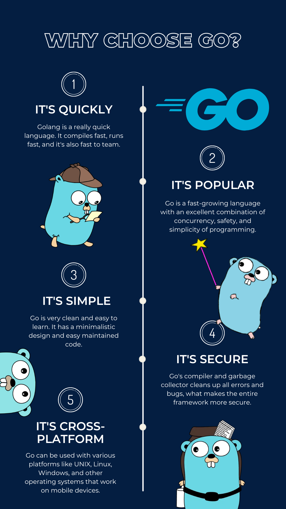
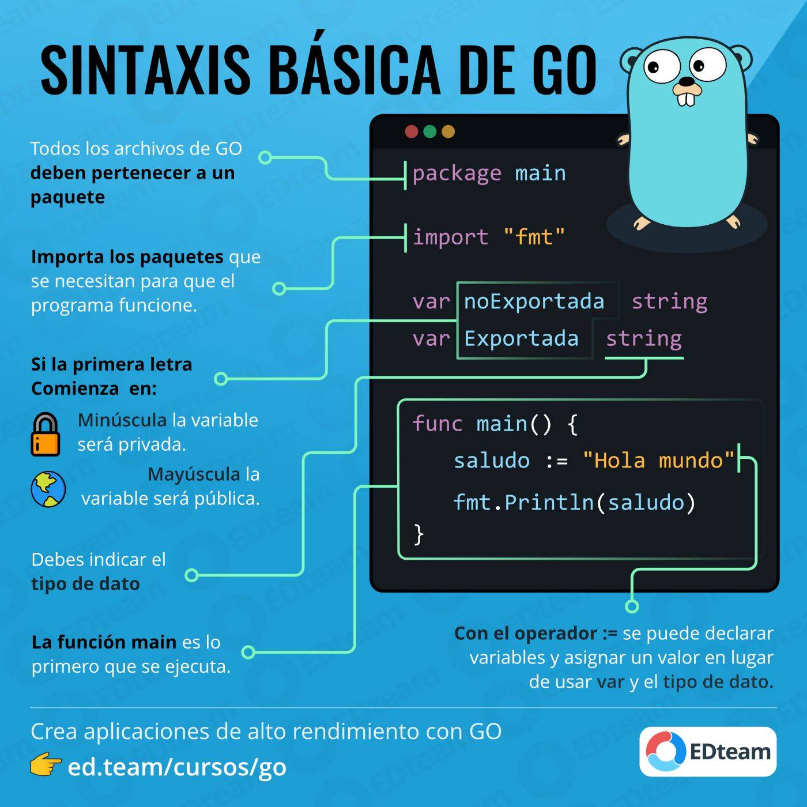

# Go

## Go como lenguaje

Go, también conocido como Golang, es un lenguaje de programación desarrollado por Google. Lanzado en 2009, Go fue diseñado para ser simple, eficiente y escalable, enfocándose en resolver algunos de los problemas que los desarrolladores enfrentaban con lenguajes más antiguos. Go combina la eficiencia y seguridad de un lenguaje compilado como C con la facilidad de uso de lenguajes interpretados como Python.

Go es especialmente conocido por su manejo de la concurrencia, lo que lo convierte en una opción ideal para aplicaciones que requieren ejecutar múltiples tareas simultáneamente. Golang ha ganado popularidad en el desarrollo de sistemas distribuidos, microservicios y aplicaciones en la nube, gracias a su capacidad para manejar grandes volúmenes de tráfico de manera eficiente.

> [Source: https://coventit.com/blog/golang-benefits](https://coventit.com/blog/golang-benefits)

## Características

Go se destaca por varias características que lo hacen único en el panorama de los lenguajes de programación:

- Lenguaje multiparadigma: soporta programación estructurada, funcional y orientada a objetos.

- Manejo eficiente de la concurrencia: Go utiliza goroutines, un sistema liviano para manejar tareas concurrentes, lo que permite ejecutar miles de tareas simultáneamente con un uso mínimo de recursos.

- Simplicidad y legibilidad: El diseño de Go se centra en ser fácil de aprender y utilizar, con una sintaxis clara y sencilla que facilita el desarrollo rápido de software.

- Compilación rápida: Go compila código de manera extremadamente rápida, generando binarios que son portátiles y eficientes, lo que mejora el proceso de desarrollo y despliegue.

- Gestión automática de la memoria: Con un garbage collector integrado, Go gestiona la memoria automáticamente, reduciendo los errores relacionados con la memoria, como las fugas de memoria.

- Ecosistema y comunidad: Golang cuenta con un ecosistema robusto y una comunidad activa que contribuye con herramientas, bibliotecas y soporte, lo que facilita la adopción y el desarrollo de proyectos en Go.

> [Source: https://ed.team/blog/que-es-go-golang](https://ed.team/blog/que-es-go-golang)

## Que es y que no es Go?

### Que si es Go

- Un lenguaje de programación eficiente: Go es ideal para construir aplicaciones de alto rendimiento y escalabilidad, especialmente en entornos de red.

- Apto para la programación concurrente: Su modelo de goroutines permite la ejecución de múltiples tareas al mismo tiempo, facilitando la creación de aplicaciones que requieren alta concurrencia.

- Un lenguaje de fácil aprendizaje: Diseñado con una sintaxis clara y simple, es accesible para nuevos programadores.

- Un entorno robusto para microservicios: Go es ampliamente utilizado para desarrollar microservicios gracias a su eficiencia y facilidad de despliegue.

- Compatible con sistemas distribuidos: Su naturaleza eficiente y la capacidad de manejar múltiples conexiones lo hacen perfecto para aplicaciones distribuidas.

### Que no es go

- Un lenguaje de propósito general para todo: Si bien Go es versátil, no es la mejor opción para aplicaciones que requieren interfaces gráficas complejas o programación en tiempo real, como videojuegos o aplicaciones de escritorio.

- Un reemplazo para todos los lenguajes: No pretende sustituir a lenguajes como Python o Java en todas las áreas; cada lenguaje tiene sus fortalezas y debilidades.

- Un lenguaje sin limitaciones: Aunque Go es poderoso, tiene características que pueden ser vistas como limitaciones, como la falta de generics en versiones anteriores (aunque se han introducido en versiones más recientes).

- Un lenguaje con una curva de aprendizaje abrupta: A pesar de ser fácil de aprender para algunos, puede presentar desafíos para aquellos que vienen de lenguajes más complejos o que no están familiarizados con la programación concurrente.

- Un lenguaje orientado a objetos completo: Aunque soporta algunos principios de la programación orientada a objetos, Go no es un lenguaje orientado a objetos en el sentido tradicional.
