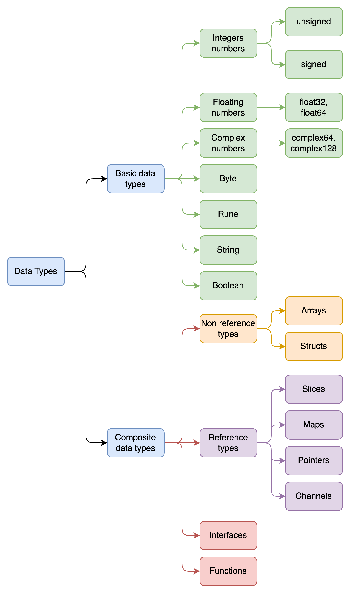

# Variables y tipos de datos

Go tiene un sistema de tipos estático y fuerte, lo que significa que las variables deben tener un tipo definido en el momento de la declaración.


## Declaración de variables

1. Declaración estándar:

   ```go
   var nombre tipo
   ```

2. Declaración con valor (asignación):

   ```go
   var nombre tipo = valor
   ```

3. Declaración con inferencia de tipo (Go infiere el tipo de forma automática)

   ```go
   var nombre = valor
   ```

4. Declaración corta (solo dentro de funciones):

    ```go
    nombre := valor
    ```

## Tipos de datos



### Tipos de datos básicos

1. Integer

Los números enteros en Go tienen diferentes subtipos según el tamaño y si son con signo o sin signo.

- int8: Tipo de dato entero con signo de 8 bits. Rango: -128 a 127.

    ```go
    var a int8 = 100
    ```

- uint8: Tipo de dato entero sin signo de 8 bits. Rango: 0 a 255.

    ```go
    var b uint8 = 34
    ```

2. Floating

Los números de punto flotante son usados para representar números racionales.

- float32: Tipo de dato de punto flotante de 32 bits.

    ```go
    var e float32 = 3.14
    ```

- float64: Tipo de dato de punto flotante de 64 bits.

    ```go
    var f float64 = 3.141592653589793
    ```

3. Complex numbers

Los números complejos en Go son representados por dos partes, real e imaginaria.

- complex64: Tipo de dato complejo que usa float32 para ambas partes.

    ```go
    var g complex64 = 1 + 2i
    ```

- complex128: Tipo de dato complejo que usa float64 para ambas partes.

    ```go
    var h complex128 = 1.0 + 2.0i
    ```

4. Byte

El tipo byte es un alias para uint8. Se utiliza comúnmente para representar datos de bytes.

```go
var i byte = 'A' // Representa el carácter 'A'
```

5. Rune

El tipo rune es un alias para int32 y representa un único código Unicode.

```go
var j rune = 'A'
```

6. String

Las cadenas en Go son secuencias de bytes y son inmutables.

```go
var k string = "Hola, mundo!"
```

7. Boolean

El tipo booleano tiene dos valores posibles: true o false.

```go
var l bool = true
```

### Tipos de datos complejos

#### Tipos de datos no referenciados

1. Arrays

Los arrays en Go son estructuras de datos de tamaño fijo que contienen elementos del mismo tipo.

```go
var m [5]int = [5]int{1, 2, 3, 4, 5}
```

2. Structs

Las estructuras permiten agrupar diferentes tipos de datos bajo un mismo nombre.

```go
type Persona struct {
    Nombre string
    Edad   int
}

var p Persona = Persona{Nombre: "Juan", Edad: 30}
```

#### Tipos de datos referenciados

1. Slices

Los slices son vistas dinámicas sobre arrays. Permiten un tamaño variable.

```go
var q []int = []int{1, 2, 3}
```

2. Maps

Los mapas son estructuras de datos que almacenan pares clave-valor.

```go
var r map[string]int = map[string]int{"uno": 1, "dos": 2}
```

3. Pointers

Los punteros almacenan la dirección de una variable.

```go
var s int = 42
var t *int = &s // t es un puntero a s
```

4. Channels

Los canales se utilizan para la comunicación entre goroutines.

```go
var u chan int = make(chan int)
```

#### Functions

Las funciones en Go son tipos de datos de primera clase, lo que significa que se pueden asignar a variables y pasar como argumentos.

```go
func suma(a int, b int) int {
    return a + b
}

var funcionSuma func(int, int) int = suma
```

#### Interfaces

Las interfaces permiten definir un conjunto de métodos que deben ser implementados por cualquier tipo que quiera "cumplir" con esa interfaz.

```go
type Describible interface {
    Describir() string
}

type Animal struct {
    Nombre string
}

func (a Animal) Describir() string {
    return "Soy un animal llamado " + a.Nombre
}

var animal Describible = Animal{Nombre: "Perro"}
```

#### Tipos personalizados

Son una forma de crear nuevos tipos basados en tipos existentes. Esto se hace para mejorar la semántica del código, hacer que sea más legible y facilitar la gestión de datos relacionados

```go
type Moneda float64

type Dolar Moneda
type Euro Moneda

func main(){
    var dolar Dolar = 20
    var euro Euro = 50

    fmt.Println(dolar)
    fmt.Println(euro)
}
```

## Buenas practicas

1. Usar inferencia de tipo cuando sea posible: Aprovechar la inferencia de tipo en lugar de declarar explícitamente el tipo de la variable cuando el valor ya lo determina claramente. Esto mejora la legibilidad y reduce la redundancia.

```go
nombre := "Juan"
edad := 30
```

2. Variables en bloques: Agrupa las declaraciones de variables relacionadas en bloques. Esto mejora la claridad y la organización del código (sobre todo si se usa en mas de un scope de tu codigo).

```go
var (
    nombre string = "Juan"
    edad   int    = 30
)
```

3. Usar nombres descriptivos para las variables: Asigne nombres descriptivos a las variables que representen conceptos complejos o complejas, como nombres de paises y ciudades. Esto ayuda a identificar mejor la estructura del código y aumenta la legibilidad.

```go
var (
    nombre string = "Juan"
)
```

4. Uso de constantes para valores inmutables: Utiliza const para declarar valores que no cambiarán durante la ejecución del programa. Esto es útil para valores mágicos y configuraciones.

```go
const pi = 3.14
```
