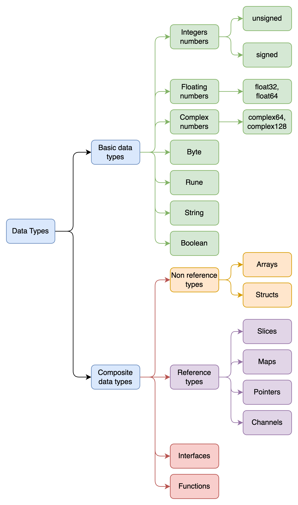

# Variables y tipos de datos

Go tiene un sistema de tipos estático y fuerte, lo que significa que las variables deben tener un tipo definido en el momento de la declaración.


## Declaración de variables

1. Declaración estándar:

   ```go
   var nombre tipo
   ```

2. Declaración con valor (asignación):

   ```go
   var nombre tipo = valor
   ```

3. Declaración con inferencia de tipo (Go infiere el tipo de forma automática)

   ```go
   var nombre = valor
   ```

4. Declaración corta (solo dentro de funciones):

    ```go
    nombre := valor
    ```

## Tipos de datos



### Tipos de datos básicos

1. Integer

Los números enteros en Go tienen diferentes subtipos según el tamaño y si son con signo o sin signo.

- int8: Tipo de dato entero con signo de 8 bits. Rango: -128 a 127.

    ```go
    var a int8 = 100
    ```

- uint8: Tipo de dato entero sin signo de 8 bits. Rango: 0 a 255.

    ```go
    var b uint8 = 34
    ```

2. Floating

Los números de punto flotante son usados para representar números racionales.

- float32: Tipo de dato de punto flotante de 32 bits.

    ```go
    var e float32 = 3.14
    ```

- float64: Tipo de dato de punto flotante de 64 bits.

    ```go
    var f float64 = 3.141592653589793
    ```

3. Complex numbers

Los números complejos en Go son representados por dos partes, real e imaginaria.

- complex64: Tipo de dato complejo que usa float32 para ambas partes.

    ```go
    var g complex64 = 1 + 2i
    ```

- complex128: Tipo de dato complejo que usa float64 para ambas partes.

    ```go
    var h complex128 = 1.0 + 2.0i
    ```

4. Byte

El tipo byte es un alias para uint8. Se utiliza comúnmente para representar datos de bytes.

```go
var i byte = 'A' // Representa el carácter 'A'
```

5. Rune

El tipo rune es un alias para int32 y representa un único código Unicode.

```go
var j rune = 'A'
```

6. String

Las cadenas en Go son secuencias de bytes y son inmutables.

```go
var k string = "Hola, mundo!"
```

7. Boolean

El tipo booleano tiene dos valores posibles: true o false.

```go
var l bool = true
```

### Tipos de datos complejos

#### Tipos de datos no referenciados

1. Arrays

Los arrays en Go son estructuras de datos de tamaño fijo que contienen elementos del mismo tipo.

```go
var m [5]int = [5]int{1, 2, 3, 4, 5}
```

2. Structs

Las estructuras permiten agrupar diferentes tipos de datos bajo un mismo nombre.

```go
type Persona struct {
    Nombre string
    Edad   int
}

var p Persona = Persona{Nombre: "Juan", Edad: 30}
```

#### Tipos de datos referenciados

1. Slices

Los slices son vistas dinámicas sobre arrays. Permiten un tamaño variable.

```go
var q []int = []int{1, 2, 3}
```

2. Maps

Los mapas son estructuras de datos que almacenan pares clave-valor.

```go
var r map[string]int = map[string]int{"uno": 1, "dos": 2}
```

3. Pointers

Los punteros almacenan la dirección de una variable.

```go
var s int = 42
var t *int = &s // t es un puntero a s
```

4. Channels

Los canales se utilizan para la comunicación entre goroutines.

```go
var u chan int = make(chan int)
```

#### Functions

Las funciones en Go son tipos de datos de primera clase, lo que significa que se pueden asignar a variables y pasar como argumentos.

```go
func suma(a int, b int) int {
    return a + b
}

var funcionSuma func(int, int) int = suma
```

#### Interfaces

Las interfaces permiten definir un conjunto de métodos que deben ser implementados por cualquier tipo que quiera "cumplir" con esa interfaz. Lo veremos con mas detalle en proximos capítulos.

```go
type Describible interface {
    Describir() string
}

type Animal struct {
    Nombre string
}

func (a Animal) Describir() string {
    return "Soy un animal llamado " + a.Nombre
}

var animal Describible = Animal{Nombre: "Perro"}
```

#### Tipos personalizados

Son una forma de crear nuevos tipos basados en tipos existentes. Esto se hace para mejorar la semántica del código, hacer que sea más legible y facilitar la gestión de datos relacionados

```go
type Moneda float64

type Dolar Moneda
type Euro Moneda

func main(){
    var dolar Dolar = 20
    var euro Euro = 50

    fmt.Println(dolar)
    fmt.Println(euro)
}
```

## Constantes

En Go, una constante es un valor que no puede cambiar durante la ejecución del programa. Se declara con la palabra clave const.

```go
const pi = 3.14
const saludo string = "Hola"
```

Se pueden declarar en bloque:

```go
const (
    Lunes    = 1
    Martes   = 2
    Miercoles = 3
)
```

```go
const(
    creditCard = "creditCard"
    debitCard = "DEBIT-CARD"
)
```

Go proporciona una herramienta poderosa para enumeraciones: iota. Es un identificador predeclarado que se incrementa automáticamente dentro de bloques de constantes.

```go
const (
    Norte = iota  // 0
    Sur           // 1
    Este          // 2
    Oeste         // 3
)
```

Cada vez que se usa iota en una línea diferente, su valor incrementa automáticamente, empezando en 0 dentro de cada bloque.

## Sombras de variables (shadowing)

El shadowing ocurre cuando una variable nueva declarada en un ámbito (scope) interno tiene el mismo nombre que una variable existente en un ámbito externo. La variable más interna "oculta" (o sombra) a la externa en ese contexto.

```go
x := 10
if true {
    x := 20 // Esto es una nueva variable x, diferente de la anterior
    fmt.Println(x) // 20
}
fmt.Println(x) // 10
```

## Comentarios adicionales y  Buenas practicas

1. Usar inferencia de tipo cuando sea posible: Aprovechar la inferencia de tipo en lugar de declarar explícitamente el tipo de la variable cuando el valor ya lo determina claramente. Esto mejora la legibilidad y reduce la redundancia.

```go
nombre := "Juan"
edad := 30
```

2. Variables en bloques: Agrupa las declaraciones de variables relacionadas en bloques. Esto mejora la claridad y la organización del código (sobre todo si se usa en mas de un scope de tu codigo).

```go
var (
    nombre string = "Juan"
    edad   int    = 30
)
```

3. Usar nombres descriptivos para las variables: Asigne nombres descriptivos a las variables que representen conceptos complejos o complejas, como nombres de paises y ciudades. Esto ayuda a identificar mejor la estructura del código y aumenta la legibilidad.

```go
var (
    Nombre string = "Juan"
)
```

4. Uso de constantes para valores inmutables: Utiliza const para declarar valores que no cambiarán durante la ejecución del programa. Esto es útil para valores mágicos y configuraciones.

```go
const pi = 3.14
```

5.  Uso de new y make.

 - new(T) asigna memoria para un valor de tipo T y devuelve un puntero.
 - make se usa para slices, maps y channels.

```go
p := new(int) // *int
s := make([]int, 5)
```

6. Comentarios y documentación.

```go
// Suma retorna la suma de dos enteros.
func Suma(a, b int) int {
    return a + b
}
```